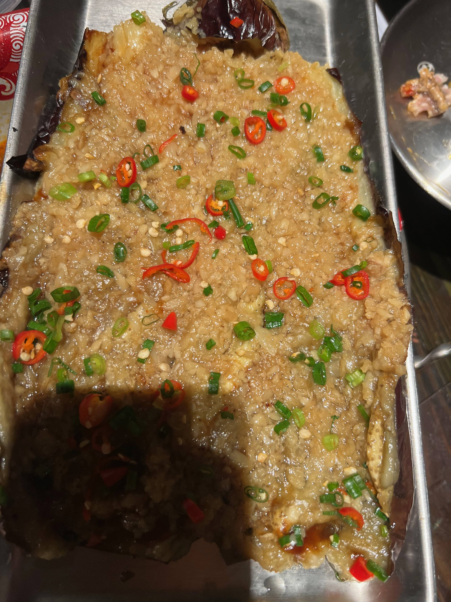

Late April is so amazing for a gastronome with lots of delicacies. The Guizhou food is authentic and the atmosphere in the barbeque is excellent and impressive.

And @skywalker, keep away from the steamed fish head with chopped chili the next time, plz!

<!--truncate-->

