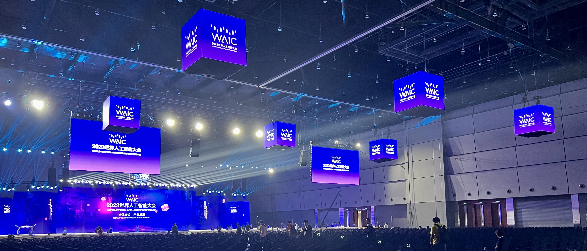
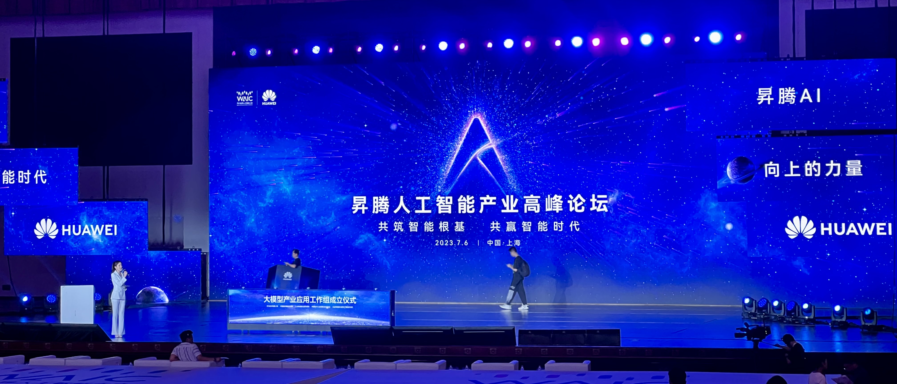
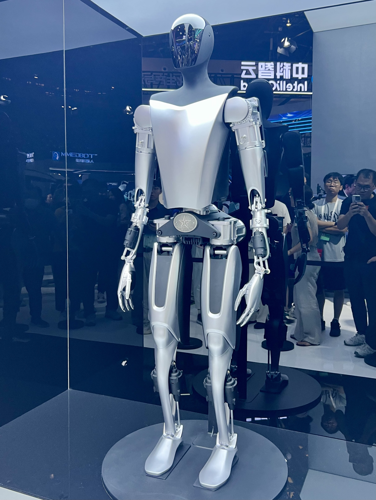
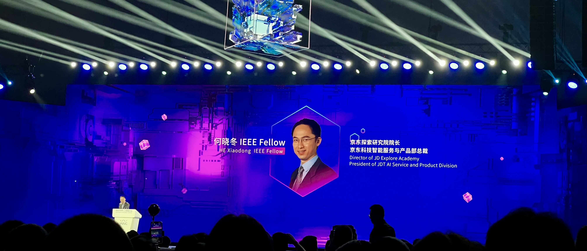

World Artificial Intelligence Conference(WAIC) is held in Shanghai, it's a nice experience to have a short look into Artificial Intelligence Appliance and Development. So fortunate for me to meet @jinlong, a famous individual known for singing at the metro entrance in his videos. Lots of gains.

<!--truncate-->

